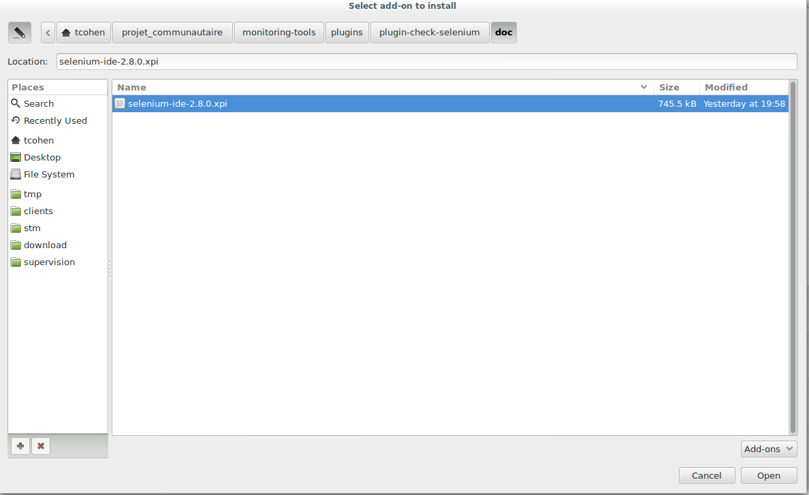
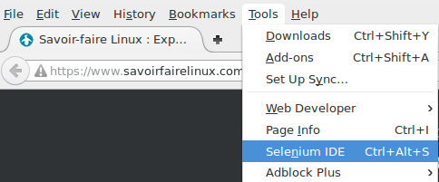
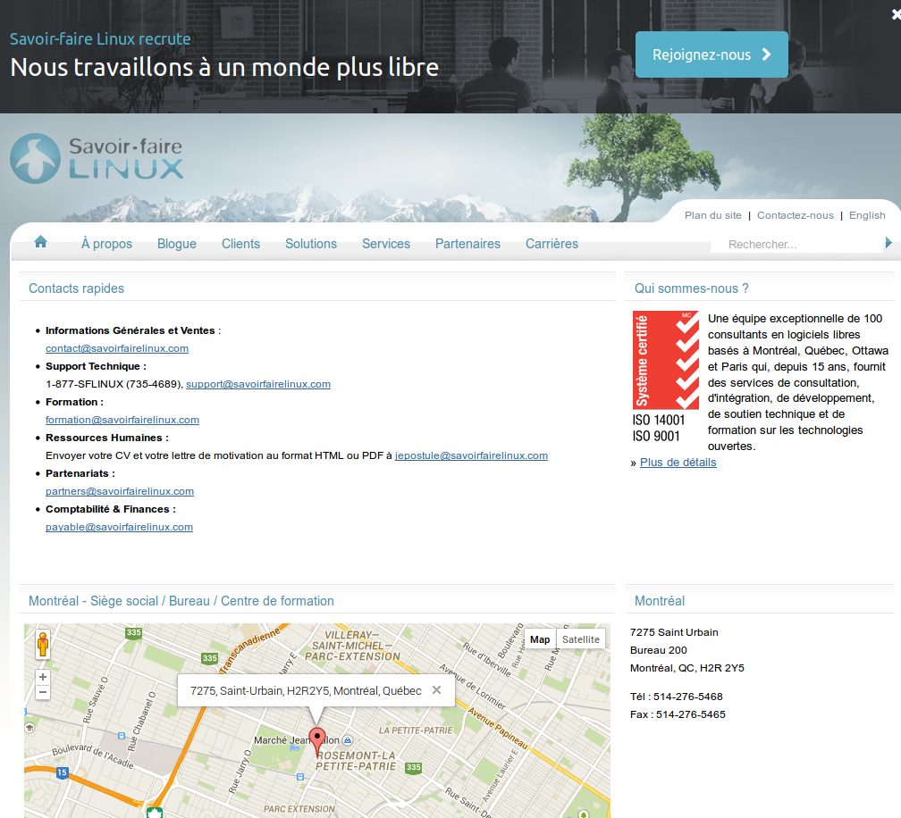

===============================
monitoring-plugins-sfl-selenium
===============================

Web scenario tests using Selenium

Firefox Selenium IDE extention
==============================

Install Selenium IDE
--------------------

You need to install Firefox Selenium IDE extension. You can get it :download:`HERE <selenium-ide-2.8.0.xpi>`

When you got this file, you have to install it in Firefox:

Click on **Tools** -> **Add-ons**

.. figure:: images/1.png
   :align: center

   *Go to Add-ons page*

On Add-ons page, select **Install Add-on from file...***

.. figure:: images/2.png
   :align: center
   
   *Install Add-on from file...*

Select **selenium-ide-2.8.0.xpi** file on your system

   
   *selenium-ide-2.8.0.xpi file*

Click on **Install Now** to install extensions

.. figure:: images/4.png
   :align: center
   
   *Click on Install Now*

Configuration
-------------

You have to change the default configuration of your Firefox Selenium IDE extention.

To open Selenium IDE window, click on **Tools** -> **Selenium IDE**

   
   *Open Selenium IDE window*

In Selenium IDE window, open settings by clicking on **Options** > **Options**

.. figure:: images/14.png
   :align: center
   
   *Menu Options*

Then go on **Locator Builders** tab

.. figure:: images/15.png
   :align: center
   
   *Locators list*

.. note:: You have to put the **link** item to the bottom of the list

How to create a new scenario
----------------------------

This is an example how to create a new web scenario.

This scenario runs on http://savoirfairelinux.com:

1. sdg
2. sdg

1. First, you have to go to the web page where the web scenario starts. In this case, it's http://savoirfairelinux.

2. Open Selenium IDE window; Click on **Tools** -> **Selenium IDE**

   
   *Open Selenium IDE window*

3. When the Selenium IDE window is open, please ensure that record button is pushed

.. figure:: images/6.png
   :align: center
   
   *Record button*

4. Now you can start your scenario.
   The first thing to do is to check if the first page is the good one.
   So, select any text in this page, right-click on it and select
   **WaitForText ....**

.. figure:: images/7.png
   :align: center
   
   *WaitForText .........*

5. In Selenium IDE window, you can check the result of your action.
   A new line was created with **WaitForText ....**

.. figure:: images/8.png
   :align: center
   
   *New line WaitForText ....*

6. Now you can continue your scenario.
   You can now click on **Contact Us** and wait th page is completely loaded

   
   *Contact Us page*

7. As on the first page, select any text in this page,
   right-click on it and select **WaitForText ....**
  
.. figure:: images/10.png
   :align: center
   
   *WaitForText .........*

8. Check the output on Selenium IDE window

.. figure:: images/11.png
   :align: center
   
   *New lines in Selenium IDE window*

Now, you can continue your scenario following this example.

.. warning:: Please read `Recommendations`_

Save scenario
~~~~~~~~~~~~~

When you have finished your scenario, you can save it.
This is **highly recommended** because, this is the only
way to edit the scenario in the future ...

To save the sceario, click on **File** > **Save test Case**

.. figure:: images/12.png
   :align: center
   
   *Save scenario*

Export scenario to Python file
~~~~~~~~~~~~~~~~~~~~~~~~~~~~~~

In order to use the scenario with the check_selenium plugin, you need to export
the scenario to a Python file.

Click on **File** > **Export Test Case As...** > **Python 2 /unitest / WebDriver**

.. figure:: images/13.png
   :align: center
   
   *Export scenario*

.. warning:: Use only LOWER CASE letters (a-z) when you export a scenario !!!!!

.. note:: This file will be used by the check_selenium plugin

Recommendations
---------------

.. warning:: Be carefull about site language:

  - When you record the web scenario, you use YOUR Firefox profile with YOUR preferences
  - When the web scenerio is played, selenium use a "vanilla" Firefox profile.

  So, default site language could be FR/ES/DE with YOUR Firefox but it could EN with "vanilla" Firefox profile.

.. danger::  Also, when you want to wait a text, choose preferally:

  * Short text
  * One line text
  * Not full uppercase text

How to use the plugin
=====================

Requirements
------------

This plugin need:

* selenium==2.44.0
* shinkenplugins==0.1.6
* xvfbwrapper==0.2.4

You can install it, with:

::

  pip install -r requirements.txt

How to use the Plugin
---------------------

Show help

::

    $ ./check_selenium -h

Launch scenario

::

   $ ./check_selenium -S scenarios -s savoirfairelinuxcom
   OK: Scenario execution time: 4.57 seconds

If you get an error/bug in your scenario with the plugin, you
can launch it in debug mode. In debug mode, Firefox will be launched
on your display. You will be able to see what Firefox does.

::
  
    $ ./check_selenium -S scenarios -s savoirfairelinuxcom -d
    OK: Scenario execution time: 4.57 seconds

You can also set the size of your Firefox use **-W** and **-H** options. This is usefull for scenario on mobile web site.

::
  
     $ ./check_selenium -S scenarios -s savoirfairelinuxcom -W 400 -H 800
     OK: Scenario execution time: 4.57 seconds

Here, the example of command which can be used in your shinken configuration.
Don't forget to add **-f** option to get perfdata and get graph.

::

    $ $USER1$/check_selenium -S $SCENARIOS_FOLDER$ -s $ARG1$ -w $ARG2$ -c $ARG3$ -f

